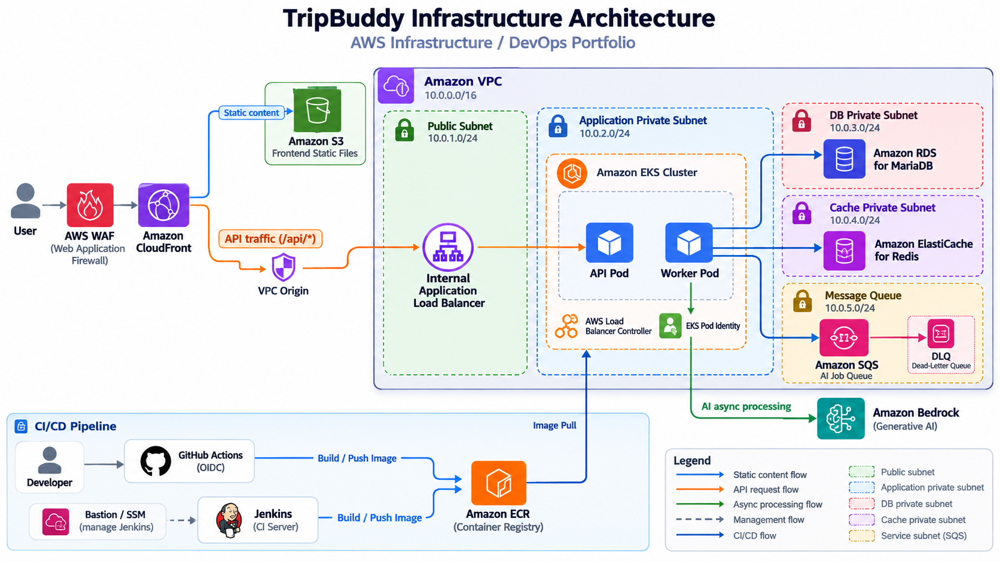
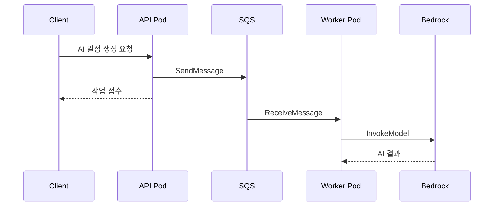

# ☁️ TripBuddy Infrastructure

> **TripBuddy 팀 프로젝트에서 담당한 AWS 인프라 설계·구축, Terraform IaC, EKS 운영 환경 및 CI/CD 구성을 정리한 포트폴리오 저장소입니다.**

TripBuddy는 여행지, 일정, 인원, 예산과 취향을 입력하면 AI가 여행 일정을 생성하고 지도 동선과 예상 경비를 제공하는 여행 플래너입니다. 이 저장소는 애플리케이션 전체 코드가 아니라 **제가 담당한 클라우드 인프라와 DevOps 영역**을 중심으로 정리했습니다.

> **Public portfolio copy**  
> 실제 프로젝트의 계정 ID, DB/Redis 엔드포인트, 팀원 IAM ARN, 비밀번호·JWT Secret 등 환경 고유값과 민감정보는 제거하거나 예시값/변수로 치환했습니다.

## 📌 Project Info

| 구분 | 내용 |
|---|---|
| 프로젝트 | TripBuddy |
| 담당 역할 | AWS Infrastructure / DevOps |
| Cloud | AWS (VPC, EKS, RDS, S3, CloudFront, SQS, ECR) |
| IaC | Terraform |
| Container | Docker / Kubernetes / Amazon EKS |
| CI/CD | Jenkins / GitHub Actions |
| Database | Amazon RDS for MariaDB |
| Cache | Amazon ElastiCache for Redis |
| Messaging | Amazon SQS |
| AI | Amazon Bedrock |

---

## 🏗 System Architecture

<p align="center">
  
</p>


### 요청 흐름

- **정적 콘텐츠:** `User → CloudFront → S3`
- **일반 API:** `User → CloudFront → VPC Origin → Internal ALB → EKS API Pod`
- **AI 일정 생성:** `API Pod → SQS → Worker Pod → Amazon Bedrock`
- **데이터:** API Pod에서 RDS와 Redis를 사용
- **이미지 배포:** GitHub Actions/Jenkins에서 Docker 이미지를 ECR로 Push 후 EKS에서 사용

---

## 👨‍💻 담당 역할과 협업

### AWS Infrastructure
- VPC와 Public / Application Private / DB / Cache Subnet 구성
- NAT Gateway, Route Table, Security Group 구성
- Amazon EKS Cluster와 Managed Node Group 구축
- AWS Load Balancer Controller 및 EKS Add-on 구성
- Amazon RDS MariaDB, ElastiCache Redis 구성
- Amazon S3 + CloudFront + WAF 기반 웹 서비스 경로 구성
- SQS + DLQ를 이용한 AI 작업 비동기 처리 인프라 구성
- ECR Repository 및 이미지 수명주기 정책 구성

### IAM / Security
- EKS Pod Identity를 이용해 API/Worker 권한 분리
- API Pod에는 SQS `SendMessage` 권한만 부여
- Worker Pod에는 SQS Consume 및 Bedrock Invoke 권한 부여
- External Secrets용 Secrets Manager 조회 권한 구성
- GitHub Actions OIDC 기반 ECR Push Role 구성
- Bastion/SSM 기반 Jenkins 관리 경로 구성

### Infrastructure as Code
- Terraform으로 AWS 인프라 코드화
- 기존 AWS 리소스와 Terraform State를 맞추기 위한 Import 작업 경험
- RDS/Redis 고가용성 전환을 위한 별도 마이그레이션 리소스 설계

### 협업
- Backend 담당자와 RDS, Redis, SQS, Bedrock 연결 방식 협의
- Frontend 담당자와 CloudFront 및 API 경로 협의
- CI/CD 담당 영역에서 ECR/EKS 배포에 필요한 IAM 및 실행 환경 구성

---

## 🧱 Infrastructure Design Points

### 1. 정적 콘텐츠와 API 트래픽 분리
프론트엔드 정적 파일은 S3에 저장하고 CloudFront를 통해 제공하도록 구성했습니다. API 요청은 `/api/*` Behavior를 별도로 두어 EKS Backend로 전달하도록 분리했습니다.

### 2. CloudFront VPC Origin을 통한 Backend 경로 개선
Public ALB를 직접 노출하는 구조에서 **CloudFront VPC Origin → Internal ALB** 구조로 전환할 수 있도록 리소스를 구성했습니다. 공개본에는 실제 ALB ARN/DNS 대신 변수만 남겼습니다.

### 3. AI 요청 비동기 처리
AI 일정 생성은 일반 API보다 처리 시간이 길기 때문에 API가 직접 Bedrock 작업을 모두 수행하지 않고 SQS에 작업을 전달하도록 구성했습니다. Worker가 큐를 소비하며 실패 메시지는 DLQ로 이동하도록 설정했습니다.



### 4. Pod 단위 최소 권한
EKS Node에 애플리케이션 권한을 몰아주지 않고 EKS Pod Identity를 이용해 API와 Worker의 IAM Role을 분리했습니다. 이를 통해 API는 SQS 전송, Worker는 SQS 소비와 Bedrock 호출이라는 각 역할에 필요한 권한만 갖도록 구성했습니다.

### 5. 데이터 계층 분리 및 고가용성 개선
RDS와 Redis는 Private 영역에 배치했으며, 별도의 DB/Cache Subnet을 구성했습니다. Redis는 Single Node에서 Multi-AZ Replication Group으로, RDS는 암호화 Snapshot 기반 새 인스턴스로 전환할 수 있는 마이그레이션 리소스를 별도로 작성했습니다.

---

## 🛠 Tech Stack

| 영역 | 사용 기술 |
|---|---|
| Cloud | AWS |
| IaC | Terraform |
| Network | VPC, Subnet, NAT Gateway, Security Group, VPC Endpoint |
| Container | Docker, Kubernetes, Amazon EKS |
| Traffic | CloudFront, VPC Origin, ALB, AWS WAF |
| Storage | Amazon S3 |
| Database | Amazon RDS for MariaDB |
| Cache | Amazon ElastiCache for Redis |
| Messaging | Amazon SQS, DLQ |
| AI | Amazon Bedrock |
| Registry | Amazon ECR |
| Identity | IAM, EKS Pod Identity, GitHub Actions OIDC |
| CI/CD | Jenkins, GitHub Actions |
| Secret Management | AWS Secrets Manager, SSM Parameter Store, External Secrets 연동용 IAM |

---

## 📁 Repository Structure

```text
TripBuddy-Infrastructure/
├── README.md
├── SECURITY.md
├── terraform/
│   ├── vpc.tf
│   ├── security_group.tf
│   ├── eks.tf
│   ├── eks_addons.tf
│   ├── eks_access.tf
│   ├── pod_identity.tf
│   ├── alb_controller_iam.tf
│   ├── rds.tf
│   ├── rds_migration.tf
│   ├── elasticache.tf
│   ├── sqs.tf
│   ├── s3.tf
│   ├── cloudfront.tf
│   ├── cloudfront_vpc_origin.tf
│   ├── waf.tf
│   ├── ecr.tf
│   ├── github_actions.tf
│   ├── jenkins.tf
│   ├── bastion.tf
│   ├── secrets.tf
│   ├── variables.tf
│   └── terraform.tfvars.example
├── kubernetes/
│   ├── backend-k8s.example.yaml
│   ├── external-secret.example.yaml
│   └── cronjob.example.yaml
├── ci/
│   └── Jenkinsfile.example
└── docs/
    ├── jenkins-bootstrap.md
    └── bastion-jenkins.md
```

---

## ⚙️ Terraform 사용 예시

> 이 저장소는 포트폴리오용 공개 사본입니다. 그대로 Apply하기 전에 리소스 비용, 버전 및 환경별 값을 반드시 검토해야 합니다.

```bash
cd terraform
cp terraform.tfvars.example terraform.tfvars

terraform init
terraform fmt -recursive
terraform validate
terraform plan
```

`terraform.tfvars`에는 AWS 계정 ID, 본인 관리 IP CIDR, S3 Bucket 이름, ALB 식별자 등 **개인 환경 값**을 넣으며 Git에는 커밋하지 않습니다.

---

## 🔄 CI/CD

### GitHub Actions OIDC
GitHub에 장기 Access Key를 저장하지 않고 OIDC로 AWS Role을 Assume한 뒤 ECR에 접근할 수 있도록 IAM Trust Policy를 구성했습니다. 허용 Repository는 변수로 주입하도록 공개본을 정리했습니다.

### Jenkins
Jenkins는 Private Subnet EC2에 배치하고, 관리자 접근은 Bastion 또는 AWS Systems Manager를 통해 수행하도록 구성했습니다. Jenkins EC2에는 Instance Profile을 부여해 별도의 AWS Access Key 없이 ECR Push가 가능하도록 했습니다.

```text
Git Push
   ↓
Jenkins / GitHub Actions
   ↓
Docker Build / Push
   ↓
Amazon ECR
   ↓
EKS Workload에서 Image Pull
```

공개 예제의 Jenkinsfile은 ECR Push까지를 보여주며, EKS Workload가 해당 이미지를 Pull해 사용합니다.

자세한 Jenkins 부트스트랩 과정은 [`docs/jenkins-bootstrap.md`](docs/jenkins-bootstrap.md)를 참고할 수 있습니다.

---

## 🔧 Troubleshooting

### 1. Terraform `EntityAlreadyExists`
**문제**  
AWS에 IAM Instance Profile 등 기존 리소스가 존재했지만 Terraform State에는 등록되어 있지 않아 동일 리소스를 새로 생성하려고 하면서 `EntityAlreadyExists` 오류가 발생했습니다.

**해결**  
기존 리소스를 삭제하지 않고 `terraform import`를 이용해 Terraform State에 등록한 뒤 Plan을 다시 확인했습니다.

**배운 점**  
Terraform에서는 코드뿐 아니라 **실제 AWS 리소스와 State의 일치 여부**를 함께 관리해야 한다는 점을 경험했습니다.

### 2. EC2 `InvalidKeyPair.NotFound`
**문제**  
EC2 생성 시 Terraform에 지정한 Key Pair와 대상 Region에 실제 존재하는 Key Pair가 일치하지 않아 인스턴스 생성이 실패했습니다.

**해결**  
Key Pair를 환경 변수(`ec2_key_name`)로 분리하고 실제 Region의 Key Pair 이름을 확인하여 적용했습니다. PEM은 저장소나 Bastion에 복사하지 않고 관리자 로컬 환경에서만 보관했습니다.

### 3. 관리자 CIDR 검증
관리 포트에 `0.0.0.0/0`을 사용하지 않도록 `admin_cidr` 변수에 Validation을 추가하고 관리자 공인 IP `/32`만 허용하도록 구성했습니다.

```hcl
validation {
  condition     = can(cidrhost(var.admin_cidr, 0)) && var.admin_cidr != "0.0.0.0/0"
  error_message = "admin_cidr must be a valid CIDR and must not be 0.0.0.0/0."
}
```

### 4. Public ALB에서 CloudFront VPC Origin으로 전환
CloudFront가 Public ALB를 Origin으로 사용하던 구조에서 Backend 노출 범위를 줄이기 위해 Internal ALB를 VPC Origin으로 연결하는 전환 구조를 추가했습니다. 공개본에는 실제 ALB ARN/DNS가 노출되지 않도록 변수화했습니다.

---

## 🔐 공개 저장소 보안 처리

원본 개발 환경의 다음 정보는 공개 사본에서 제거했습니다.

- RDS / Redis 실제 Endpoint
- 실제 DB Password / JWT Secret / 외부 API Key
- AWS Account ID
- ECR Registry Account ID
- 팀원 IAM User ARN
- 외부 백업 DB IP 및 계정 정보
- 환경별 ALB ARN / DNS
- Terraform State 및 `terraform.tfvars`
- PEM / Private Key

Kubernetes Secret 값은 코드에 직접 저장하지 않고 Secret Management Workflow로 주입하는 예제를 남겼습니다.

---

## ✅ 구축 및 검증 관점

인프라 리소스 생성 자체에서 끝내지 않고 다음 서비스 흐름을 기준으로 연결을 확인했습니다.

```text
Frontend / CloudFront
        ↓
      API Path
        ↓
  ALB / Amazon EKS
        ↓
  Spring Boot Backend
     ↙       ↘
   RDS       Redis
        ↓
      SQS
        ↓
   Worker / Bedrock
```

또한 Terraform 변경 시 바로 Apply하기보다 Plan을 먼저 확인하여 기존 AWS 리소스가 의도치 않게 변경·교체되지 않는지 검토하는 방식으로 작업했습니다.

---

## 📝 프로젝트를 통해 배운 점

TripBuddy 인프라를 구축하면서 개별 AWS 서비스를 생성하는 것보다 **사용자 요청이 어떤 경로로 들어와 애플리케이션, 데이터베이스, 메시지 큐, AI 서비스까지 연결되는지 전체 흐름을 이해하는 것이 중요하다**는 점을 배웠습니다.

또한 Terraform을 도입하면서 실제 AWS와 State의 정합성, IAM 최소 권한, Private Network에서의 운영 접근, AI처럼 처리 시간이 긴 작업의 비동기 분리 등 실제 서비스 배포 과정에서 필요한 인프라 관점을 경험했습니다.

---

## ⚠️ Note

이 저장소는 교육/포트폴리오 목적으로 정리한 공개 사본이며, 실제 운영 환경의 완전한 복제본이 아닙니다. 일부 환경 고유 리소스는 예시값 또는 Terraform 변수로 치환되어 있습니다.
